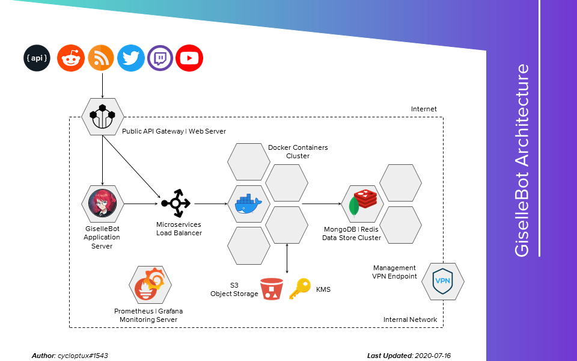

Technical & Security Background
===============================

*Last Revised: November 15, 2021*

------------------------------------------------------------------------

Core Engine
-----------

The bot is written in Node.js, and uses [Discord.js
v13](https://discord.js.org/) as core Discord library.

Here are some info and numbers about {{bot.name}}

- 99.85% uptime.
- 28 self-developed RESTful microservices, supporting the bot in its operations.
- ~90,000 lines of code.
- Present in ~10,000 Discord servers, reaching ~7.8M users.
- Development started in September, 2017.
- GiselleBot turned from being a private bot into a public bot in March 2018.
- Since December 2019, GiselleBot has handled over 870,000 successful commands, with an average of ~1,200 commands per day.
------------------------------------------------------------------------

Infrastructure
--------------

<figure markdown>
  
</figure>

The bot is hosted on GalaxyGate. The infrastructure is currently composed of 5 main
components:

- 1 Web Server, hosting the documentation website and the API gateway used to communicate with
    the bots(s) from the external world.
- 1 Application Server, hosting the bot itself.
- 1 Application Server, hosting the supporting microservices.
- 3 MongoDB machines, forming a high-availability Replica Set.
- 3 Redis instances, forming a high-availability set managed through
    Redis Sentinel.
    -   Redis is used a high performance in-memory cache for the most
        used DB queries.
    -   The instances are hosted on the same servers that host MongoDB,
        but the Primary instance of each datastore is on different
        servers at any time.

Other than the plain computing power, from GalaxyGate, some PaaS services are provided by Amazon Web Services:

- Object Storage buckets, hosting the temporary (encrypted) files that
    are sent to end-users via a variety of commands.
- A centralized log management system.
- A Key Management System / Secrets Manager, storing the secret keys 
    and API keys used by the bot. Private keys and/or credentials are 
    never stored on the actual servers, they are fetched during the 
    startup of each service.
- A DNS managed service, hosting the public cycloptux.com and
    gisellebot.com domains, the short gisl.eu domain and the internal
    private domain.

------------------------------------------------------------------------

Security
--------

Regarding the security aspects of the bot, here's a list of features
that have been implemented:

### Encryption in Transit

- Internal network communications between all infrastructure components 
    only happen on a private network (VLAN) specifically instanced by the 
    hosting provider, and never go through the internet.pplication server,
    web server, microservices and DB machines are encrypted using SSL/TLS
    (specifically, TLS 1.1+) encryption, with 2-way forced validation of
    server and client certificates.
- Network connections between the API gateway and the application
    server and microservices are encrypted using HTTPS (TLS 1.2+)
    encryption, with forced 2-way validation of server and client
    certificates.
- The certificates used to encrypt data in transit are released by an
    internal Certificate Authority (which is on a different hosting 
    provider, and powered off when not in use, to protect its keys). 
    The certificates are signed by an intermediate CA which then points
    at the root CA, so that the root CA key is never used and the 
    intermediate CA can be killed if compromised.
- The web server and API gateway are only exposed to the internet
    through HTTPS (HSTS). The web access itself is protected through
    [Cloudflare](https://www.cloudflare.com/). The network connection
    between Cloudflare and the actual web server is also protected by
    strict HTTPS using automatically renewed certificates signed by
    [Let\'s Encrypt](https://letsencrypt.org/).

### Encryption at Rest

-   All storage media (hard disks, object storage repositories, etc.)
    are protected through low-level encryption.
-   Potentially sensitive and personal data (basically, anything that
    can be assimilated to a string) stored in the database is encrypted
    using military-grade AES-256-GCM and AES-128-GCM algorithms.
-   Commands that generate big files (such as a chat log) may transmit
    the file to the user via Direct Message by temporarily storing it
    into an encrypted Object Storage bucket. The archive itself is also
    encrypted using 7-Zip\'s encryption algorithm, based on AES-256.
    -   The password is purposefully never logged into the bot internal
        logs and is only known to the end user.
    -   As an extra layer of security, users can decide to delete the
        bot\'s message so that the password is also removed from Discord
        itself. Refer to `deletedm`{.interpreted-text role="ref"} for
        more info.
    -   The retention for these files is currently set to 30 days.

### Authentication, Authorization, Auditing

-   SSH access to the infrastructure is only available from within the
    internal network. The internal network can be accessed through a
    hardened bastion VPN endpoint.
-   SSH access to the virtual servers is protected via private keys and,
    in some cases, multifactor authentication.
-   Sensitive information needed by the microservices are either fetched
    from the KMS when the microservice starts, or passed through
    temporary environmental variables.
-   Every access and action is logged, both in the API gateway and in
    the application server. All bot commands are logged.
-   The API offered by the bots are not directly accessed from the
    internet. The API gateway acts as a bridge, and implements a fully
    fledged authentication and authorization workflow used to create and
    distribute temporary tokens to the end users. Further authorization
    checks are applied on the specific API calls to restrict
    "authorized" users from requesting data that doesn't belong to
    them.

### Infrastructure Security

- Each host is protected by a local firewall, making sure that only 
    the required ports are open.
- The SSH service is not exposed to the internet.
- Infrastructure management portals are protected by strong
    passwords and multifactor authentication.
- Encryption keys, secret access keys, secret tokens, credentials,
    etc. are **never** stored into local drives. An external Key
    Management System (KMS) is used to fetch secret keys at runtime.
- The database is backed up every 12 hours, and the retention policy
    for backup files is set to keep backups on a highly available Object
    Storage repository for at least 30 days.
- The source code for the bot, and all of its related dependencies, is
    stored in private Git-based repositories.
