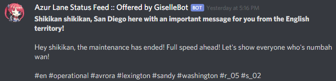

Azur Lane Integration
=====================

This module contains a few commands used to get information about **Azur
Lane**, a side-scrolling shoot 'em up mobile video game created by
Chinese developers Shanghai Manjuu and Xiamen Yongshi, released in 2017
for the iOS and Android operating systems.

The game was released in 4 regions/versions:

-   **CN** (Chinese)
-   **JP** (Japanese)
-   **KR** (Korean)
-   **EN** (English/Global)

Commands
--------

### {{bot.prefix}}azurstatus

#### Command Syntax
!!!example ""

        {{bot.prefix}}azurstatus [--region {region code}]

#### Command Description

Checks the status of Azur Lane's game servers. Omitting the region code
will assume `--region en` and show the status of the (4, at the time of
writing this page) English servers.

The Chinese region will print 2 embeds: one for the Android servers, one
for the iOS servers. Other regions have common servers among the 2
platforms.

#### Examples
!!!example ""

        {{bot.prefix}}azurstatus
        {{bot.prefix}}azurstatus --region cn

------------------------------------------------------------------------

Server Status Live Feed
-----------------------

The Azur Lane Server Status Feed offers an easy way to monitor Azur Lane
servers availability for **any region**, and be notified when something
changes on one (or more) of the webhooks configured in your Discord
server.

!!!info "See Also"

        In order to better understand this module, it's very important that you
        are familiar with Discord webhooks. For more details about this Discord
        feature, please take a look at [this official
        guide](https://support.discord.com/hc/en-us/articles/228383668-Intro-to-Webhooks).

By default, the status feed mascot will be the Azur Lane character
(ship) **San Diego**, and all the feed messages will be Azur
Lane-themed.

The full list of feed messages and monitored transitions can be found
[in this Google
Spreadsheet](https://docs.google.com/spreadsheets/d/1TGtR5Ffp4segbB4sFYfi1J9dyGc48jbQdBlwELpgzaQ/edit?usp=sharing).

Each message will be followed by a list of hashtags, that users may use
to filter the specific messages they are interested into, indicating:

-   The region code whom the message refers to: `#cn` `#en` `#jp` `#kr`
-   The current status of the region, using a technical status tag:
    `#gateway_error` `#full_offline` `#partial_offline` `#operational`
-   One or more server name tags, indicating the specific impacted
    servers: e.g. `#avrora` `#lexington` ...
-   The quote ID (refer to the [Azur Lane Server Status Feed Sentences Google
    Spreadsheet](https://docs.google.com/spreadsheets/d/1TGtR5Ffp4segbB4sFYfi1J9dyGc48jbQdBlwELpgzaQ/edit?usp=sharing))
    for the region status transition and/or server status transition:
    e.g. `#r_01` `#r_02` `s_02` ...

### {{bot.prefix}}azurhook

#### Command Syntax
!!!example ""

        {{bot.prefix}}azurhook (webhook URL or --channel (channel id/mention/q_name)) [customization params]

#### Command Description

Starts a live feed on the specified webhook. When a new transition is
found, its notification will be sent to the specified webhook service.

!!!danger "Danger"

        Discord webhooks are a very powerful feature, but they (currently) lack
        2-way authentication of messages. This means that a malicious user
        knowing a webhook URL will be able, with some effort, to forge a message
        containing any kind of content using external tools and send that
        message to the webhook. In order to protect yourself from this (rare)
        occasion, make sure you run this command in non-public channels.

!!!abstract "Note"

        Alternatively, you can replace the webhook URL with the
        
        `--channel (channel id/mention/q_name)` parameter: a new dedicated webhook will be created and the URL from the new webhook will be automatically used for this feed.

        This alternative option requires {{bot.name}} to have "Manage Webhooks" permissions.

**Customization Params**
##### `--region (first region code) [second region code] [...]`

Adds a **whitelist**, **inclusive** filter for Azur Lane server regions
to the stream. Transitions that are referring to (one of) the selected
region(s) will be sent to the webhook, while the rest will be skipped.

This parameter only supports these region codes: `cn` `en` `jp` `kr`

Region codes are case-insensitive.

**Default**: No filter (all regions)

##### `--filter (first word) [second word] [...]`

Adds a **whitelist** filter to the feed. In this example, if the status
quote contains `first word` and/or (see below) `second word`, the
submission will be sent to the webhook, otherwise it will be ignored. You
can set one or more words, case-insensitive. This is especially
effective if you are using the provided hashtags to filter specific
events of interest.

You can also set "composite words" (two or more words as a single
filter) by quoting them: `"foo bar" test` will count as 2 filter
elements: `foo bar` and `test`.

The filter works on partial words (e.g. "announce" will work on both
"announcement" and "announced").

The filter only checks the "quote text", column **G** of the [Azur Lane Server Status Feed Sentences Google
Spreadsheet](https://docs.google.com/spreadsheets/d/1TGtR5Ffp4segbB4sFYfi1J9dyGc48jbQdBlwELpgzaQ/view),
and the additional message hashtags (if you filter by hashtag, you must include the "#").

**Default**: No filter

##### `--mode (AND/OR)`

Sets the filter behavior when more than 1 word is added to the whitelist
filter.

-   `AND` will only allow status transition notifications that contain
    *all* of the filtered words.
-   `OR` will allow status transition notifications that cointain at
    least one of the filtered words.

**Default**: `OR`

##### `--include` or `--exclude`

Sets the filter behavior one or more words are added to the whitelist
filter.

-   `--include` will only allow status transition notifications that
    contain the filtered word(s).
-   `--exclude` will only allow status transition notifications that
    **do not** contain the filtered word(s).

These parameters will work together with `--mode (AND/OR)`, allowing the
server status feed to filter based on INCLUDING the filter items (e.g.,
at least one filter item (OR) or all filter items (AND) are included in
the submission) or EXCLUDING filter items (e.g., post if all filter
items are absent from the submission (AND) or at least one filter item
is absent from the submission (OR)).

**Default**: `--include`

!!!tip "Tip"

        Using both parameters in the same command will give `--include` the strict priority and ignore `--exclude`.

##### `--header (message)`

Adds a custom header message when status transition notifications are
posted. Custom headers can have a maximum of **1024** characters.

!!!tip "Tip"

        Custom headers **can** be formatted as embeds by following a very specific syntax. 

!!!warning "Warning"

        Do know that both {{bot.name}} and Discord are very sensitive to this specific syntax, which is easily "broken" by special characters: for this reason, using embeds as header is not suggested, nor directly supported. **Use them at your own risk!** If you are brave enough, I suggest the usage of [this embed generator](https://leovoel.github.io/embed-visualizer/) (click on the **"Enable webhook mode"** button at the bottom of the page).

Custom headers support a few dynamic tags that are replaced with their
respective "real" value during run-time. These are:

-   **%region%**: This will be replaced with the region name,
    capitalized (e.g. `Chinese`, `English`, ...)
-   **%region\_code%**: This will be replaced with the region code,
    uppercase (e.g. `CN`, `EN`, ...)
-   **%timestamp% or %timestamp_utc%**: This will be replaced with the
    status transition UTC time, with format `YYYY-MM-DD HH:mm:ss (UTC)`.
-   **%timestamp_iso%**: This will be replaced with the status
    transition UTC time, as ISO8601 string.
-   **%timestamp_pst%**: This will be replaced with the status
    transition PST time, with format `YYYY-MM-DD HH:mm:ss (PST)`.

Timestamp tags also support custom time zones. You can replace the `utc`
part with either:

-   A different **valid** time zone identifier: use the
    [`{{bot.prefix}}searchtz`](/GiselleBot-Documentation/Utility/util/#searchtz) command to look for a valid
    time zone name.

-   An **UTC offset**, in the form of
    `[UTC/GMT](+/-)(hours)[:][minutes]`. Here are some valid examples:

    > -   %timestamp_Europe/London%
    > -   %timestamp_America/Los_Angeles%
    > -   %timestamp_Japan%
    > -   %timestamp_PST8PDT%
    > -   %timestamp_+0800%
    > -   %timestamp_-10:30%
    > -   %timestamp_UTC+2%

All headers will be followed by the actual quote text, including the
additional hashtags.

**Default**:
`Shikikan shikikan, San Diego here with an important message for you from the %region% territory!`

##### `--webhook-name (custom name)`

Adds a custom username to the webhook when status transition
notifications are posted. Custom usernames can have a maximum of 32
characters.

**Default**: "Azur Lane Status Feed :: Offered by {{bot.name}}"

##### `--no-username-overwrite`

Removes any custom name from the webhook. The real webhook name (the one
that you assigned when creating the webhook in Discord) will be used.

**Default**: `false` (Custom or default names will be applied)

##### `--no-avatar-overwrite`

Removes any custom avatar from the webhook. The real webhook avatar (the
one that you assigned when creating the webhook in Discord) will be
used.

**Default**: `false` (Automated avatars will be applied)

#### Permissions Needed

**User**: Manage Webhooks

#### Examples
!!!example ""

        {{bot.prefix}}azurhook <https://discord.com/api/webhooks/123456789098765432/LONG_WEBHOOK_TOKEN>
        {{bot.prefix}}azurhook <https://discord.com/api/webhooks/123456789098765432/LONG_WEBHOOK_TOKEN> --region en --header %region_code% server status changed at %timestamp%

------------------------------------------------------------------------

### {{bot.prefix}}azurehook

#### Command Syntax
!!!example ""

        {{bot.prefix}}azurehook (feed index) [new customization params]

#### Command Description

**Replaces** all previously set customization params for the selected
feed with a new set of customization params. The feed index is the
number shown with [{{bot.prefix}}azurlhook](/GiselleBot-Documentation/Fun And Games/azurlane#azurlhook).

!!!warning "Warning"

        Editing the webhook will not change the existing params, it will completely replace them. Take note of the existing params first, and use them in the command!

#### Permissions Needed

**User**: Manage Webhooks

------------------------------------------------------------------------

### {{bot.prefix}}azurrhook

#### Command Syntax
!!!example ""

        {{bot.prefix}}azurrhook (feed index)

#### Command Description

Stops a previously set feed and removes its link to the server webhook.
The stream index is the number shown with [{{bot.prefix}}azurlhook](/GiselleBot-Documentation/Fun And Games/azurlane#azurlhook).

#### Permissions Needed

**User**: Manage Webhooks

#### Example
!!!example ""

        {{bot.prefix}}azurrhook 1

------------------------------------------------------------------------

### {{bot.prefix}}azurlhook

#### Command Description

Prints a list of all feeds that are linked to webhooks in the current
server.
