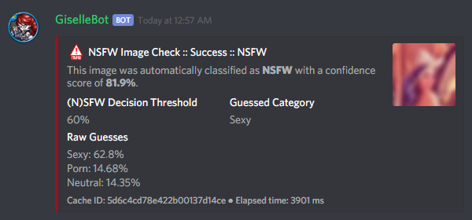

\*\*\*\*\*\*\*\*\*\*\*\***\* Utility
Commands**\*\*\*\*\*\*\*\*\*\*\*\*\*\*

This module contains generally useful, atomic commands that aren\'t
otherwise categorized into a dedicated module.

These commands might be safe for use by anyone, or locked behind
in-Discord permissions.

NSFW Images Detection Tools {#nsfwjs}
===========================

implements an (experimental) **NSFW images detection system** using
**TensorFlow.js** as its base.

The detection system is based on [Infinite Red\'s NSFW JS
library](https://nsfwjs.com/) and [GantMan\'s Inception v3 Keras Model
for NSFW detection](https://github.com/gantman/nsfw_model/) to classify
any image as a composition of **5** categories:

-   **Drawings**: Safe for work drawings (including anime).
-   **Hentai**: Hentai and pornographic drawings.
-   **Neutral**: Safe for work neutral images.
-   **Porn**: Pornographic images, sexual acts.
-   **Sexy**: Sexually explicit images, not pornography.

The module was furtherly converted into a back-end module and customized
with a caching system to enhance its performance.

::: {.seealso}
[This interesting article by Infinite Red](https://nsfwjs.com/) explains
the reasons behind the creation of the original NSFW JS client-side
module.
:::

::: {.warning}
::: {.title}
Warning
:::

This module, by no means, is supposed to reliably recognize all NSFW
images. Its main purpose is quickly classifying provided images and
supporting humans in better moderating a server.

The module itself will not store or expose any sexually explicit images.
The output will not contain a direct link to the original image, and a
censored (low resolution, blurred) version of the image will be locally
cached and used to refer to the original image.
:::

Here\'s an example of an output of this command, and the corresponding
censored image:

{.align-center
width="600px"}

{.align-center}

::: {.seealso}
For those of you with a background in image processing - yes, **Lenna**
is actually flagged as **NSFW with a confidence score of 81.9%!**

If you don\'t know what I\'m talking about, refer to [this Wikipedia
page](https://en.wikipedia.org/wiki/Lenna).
:::

nsfwcheck
---------

### Command Syntax

::: {.parsed-literal}
nsfwcheck (image URL, or image as a message attachment)
:::

### Command Description

Submits an image against the [GantMan\'s Inception v3 Keras Model for
NSFW detection](https://github.com/gantman/nsfw_model/) (as explained
above) and returns a detailed output about the classification.

### Examples

::: {.parsed-literal}
nsfwcheck <http://www.lenna.org/lena_std.tif>
:::

------------------------------------------------------------------------

nsfwcache
---------

### Command Syntax

::: {.parsed-literal}
nsfwcache (cache ID)
:::

### Command Description

Recalls an image classification output by its cache ID (as given in the
footer of the nsfwcheck command.

### Examples

::: {.parsed-literal}
nsfwcache 5d6c4cd78e422b00137d14ce
:::

------------------------------------------------------------------------

nsfwthreshold
-------------

### Command Syntax

::: {.parsed-literal}
nsfwthreshold \[new threshold, or \"-\"\]
:::

### Command Description

While the classification scores given to an image cannot be tuned, each
server can choose its own NSFW threshold (the sum of NSFW-related scores
over which an image is considered NSFW).

The new threshold is an integer within the range `[0, 100]`, inclusive
of `0` (treat **all** images as NSFW) and `100` (only treat an image as
NSFW if the model recognize it as having no-SFW components - which is
highly unlikely, hence basically meaning \"treat **no** images as
NSFW\").

Running the command with `-` as argument will reset the server threshold
to the global, default threshold of **60%**.

Running the command with no arguments will show the current value for
the server.

### Examples

::: {.parsed-literal}
nsfwthreshold 80 nsfwthreshold -nsfwthreshold
:::

### Permissions Needed

| **User**: Manage Server

------------------------------------------------------------------------

Server-related Tools
====================

serverinfo
----------

### Command Syntax

::: {.parsed-literal}
sinfo
:::

### Command Description

Prints a bunch of info about the current server.

------------------------------------------------------------------------

serverbots
----------

### Command Syntax

::: {.parsed-literal}
sbot \[\--detail\]
:::

### Command Description

Prints the full list of bots that are present in the server.

If the `--detail` additional parameter is used, the command will attempt
scanning the top 3 most used bot listing websites to get info about the
bot owner, and post a link to the found page.

The command will scan:

> -   **Top.gg / Discord Bot List**: <https://top.gg/>
> -   **Bots on Discord**: <https://bots.ondiscord.xyz/>
> -   **Discord Bots**: <https://discord.bots.gg/>

This additional scan is usually very slow (about \~5 seconds per bot).

------------------------------------------------------------------------

serveremojis
------------

### Command Syntax

::: {.parsed-literal}
semoji
:::

### Command Description

Shows all of the emojis from the current server into an embed.

------------------------------------------------------------------------

createinvite
------------

### Command Syntax

::: {.parsed-literal}
createinvite \[\--channel {channel id/mention/q\_name}\] \[\--expire
{duration timecode}\] \[\--uses {\# of uses}\] \[\--unique\]
\[\--temporary\]
:::

### Command Description

Creates an instant invite to the current server. All parameters are
optional, here are the meanings of eaach parameter and the default
values:

> -   `--channel` selects a target channel for the invite. The user
>     running the command must have \"View Channel\" and \"Create
>     Instant Invite\" permissions on the target channel. **Default**:
>     the current channel.
> -   `--expire` sets how long the invite should last (use the time code
>     syntax, e.g. `1h`). **Default**: no expiration.
> -   `--uses` sets the maximum number of uses for the invite.
>     **Default**: unlimited uses.
> -   `--unique` create a unique invite if selected, or uses an existing
>     one with similar settings otherwise. Timed invites are always
>     unique by default. **Default**: false (use an existing if
>     available).
> -   `--temporary` sets whether members that joined via the invite
>     should be automatically kicked after 24 hours if they have not yet
>     received a role. **Default**: false.
> -   `--alias` adds an optional alias (one word, maximum 32 characters
>     long) to the invite. If the **Members** logger with invites
>     tracking is active (refer to `log-command`{.interpreted-text
>     role="ref"}) the alias will be shown under \"Using Invite: \...\".
>     **Default**: no alias.

### Permissions Needed

| **User**: Manage Server, Create Instant Invite
| **Bot**: Create Instant Invite

------------------------------------------------------------------------

invitesusage
------------

### Command Syntax

::: {.parsed-literal}
invitesusage \[\--channel {channel id/mention}\] \[\--inviter {user
id/mention}\]
:::

### Command Description

Shows usage stats about active invites in the current server.

You can filter by invite target channel through the `--channel`
parameter, or by inviter through the `--inviter` parameter.

### Permissions Needed

| **User**: Manage Server, Create Instant Invite
| **Bot**: Create Instant Invite

------------------------------------------------------------------------

searchuser
----------

### Command Syntax

::: {.parsed-literal}
searchuser (user id/mention)
:::

### Command Description

Searches for a user and returns the known info about that user.

### Examples

::: {.parsed-literal}
searchuser \@cycloptux\#1543 searchuser 123456789098765432
:::

------------------------------------------------------------------------

Message-related Tools
=====================

publish
-------

### Command Syntax

::: {.parsed-literal}
publish \[message id(s)\] \[\--channel {channel id/mention/q\_name}\]
:::

### Command Description

This command will publish one or more messages sent into an
**Announcement Channel**. For more info about Announcement Channels and
the publish feature, you can check [this
link](https://support.discord.com/hc/en-us/articles/360032008192-Announcement-Channels-)
from Discord.

By default, the command will look for messages in the current channel.
You can, however, specify a different channel using the `--channel` tag.
Please make sure that the target channel is an Announcement Channel,
otherwise will throw an error.

If the message ID(s) are omitted, will attempt to publish the most
recent message (above the command itself).

You can also specify one or more ID(s) to publish specific messages from
the target channel.

::: {.note}
::: {.title}
Note
:::

This specific command is particularly useful for **mobile users**, until
Discord adds the ability for the mobile client to publish messages
through the UI.
:::

### Permissions Needed

While technically available to everyone, this command will check for the
correct permissions for a user to be able to post/publish a message,
according to Discord limitations:

-   **Send Messages Permission** will let you publish your own messages
    in the Announcement Channel
-   **Manage Messages Permission** will let you publish all messages in
    the Announcement Channel

This also applies to : Manage Messages Permissions will be required to
publish messages coming from other users, but Send Messages Permissions
will be enough to make publish its own messages (e.g. messages sent
through the `msgsend`{.interpreted-text role="ref"} command).

### Examples

::: {.parsed-literal}
publish publish 123456789098765432 234567890987654321 publish
123456789098765432 \--channel \#announcements
:::

------------------------------------------------------------------------

autopublishsetup
----------------

### Command Syntax

::: {.parsed-literal}
autopublishsetup \[channel id/mention/q\_name\]
:::

### Command Description

This command will open an interactive menu to configure the auto-publish
feature on a target channel, provided the channel is set as an
**Announcement Channel**. For more info about Announcement Channels and
the publish feature, you can check [this
link](https://support.discord.com/hc/en-us/articles/360032008192-Announcement-Channels-)
from Discord.

You can manually publish messages through using the
`publish`{.interpreted-text role="ref"} command. Through the use of the
auto-publish feature, however, you can set certain Announcement Channels
to have all messages (or a subset of messages) automatically published
upon being sent.

Options 1. and 2. are used to save the settings you applied through the
menu (the settings will not apply until you save them), or discard said
changes.

1.  \"Publish all messages\" will automatically publish all messages
    sent into the target channel. When this setting is enabled, enabling
    or disabling any of the subsequent settings will not have any
    effect.
2.  \"Publish all user messages\" will automatically publish all
    messages coming from real users, ignoring bot messages and
    webhook/integration messages.
3.  \"Publish all bot messages\" will automatically publish all messages
    coming from bots, but ignore webhook/integration messages.
4.  \"Publish all webhook messages\" will automatically publish all
    messages coming from webhooks or external integrations.
5.  \"Publish if the user/bot has at least one of these roles\" will
    automatically publish messages coming from bots or users having
    certain roles, and ignore webhook/integration messages or messages
    coming from bots/users not having any of those roles.

::: {.note}
::: {.title}
Note
:::

You can configure options 4, 5, 6, and 7 in any mixed set to achieve the
desired behavior. Please note that options 4 and 5 will override the
role requirements configured through option 7 on the corresponding
entity.
:::

If the **Messages** log is enabled in a server channel, each
automatically published message will generate an entry into that log.
Even publishing errors (e.g. due to rate limits) are logged.

Please refer to the `log-command`{.interpreted-text role="ref"} section
in the **Administration** module documentation.

### Permissions Needed

| **User**: Manage Server

**Manage Server Permissions** are required to open the configuration
menu.

For the \"publishing\" permissions themselvers, this command will check
for the correct permissions for a user to be able to post/publish a
message, according to Discord limitations:

-   **Send Messages Permission** will let you publish your own messages
    in the Announcement Channel
-   **Manage Messages Permission** will let you publish all messages in
    the Announcement Channel

This also applies to : Manage Messages Permissions will be required to
publish messages coming from other users, but Send Messages Permissions
will be enough to make publish its own messages (e.g. messages sent
through the `msgsend`{.interpreted-text role="ref"} command).

### Examples

::: {.parsed-literal}
autopublishsetup autopublishsetup \#announcements
:::

------------------------------------------------------------------------

autoreactsetup
--------------

### Command Syntax

::: {.parsed-literal}
autoreactsetup \[channel id/mention/q\_name\]
:::

### Command Description

Through the use of the auto-react feature, you can set pick a group of
emojis that will be added to all messages (or a subset of messages)
posted in a certain channel. You can enable this feature in more than
one channel, and each channel can have a different set of emojis.

You can select up to 20 emojis per channel. You can select native
(Unicode) emojis, or custom emojis as long as the emoji is available in
the current server.

There is a **server-wide rate limit** to the amount of emojis that can
be applied through the auto-react feature in a certain amount of time.
will stop adding reactions after hitting **50 reactions in 5 minutes**,
on a rolling time window.

This command will open an interactive menu to configure the auto-react
feature on a target channel.

Options 1. and 2. are used to save the settings you applied through the
menu (the settings will not apply until you save them), or discard said
changes.

3.  \"Select emojis\" will allow you to set 1 or more emojis, specific
    to the channel you are configuring, that will automatically be
    applied to new messages according to the following conditions. An
    empty list will effectively disable the auto-react feature.
4.  \"Publish all messages\" will automatically publish all messages
    sent into the target channel. When this setting is enabled, enabling
    or disabling any of the subsequent settings will not have any
    effect.
5.  \"Publish all user messages\" will automatically publish all
    messages coming from real users, ignoring bot messages and
    webhook/integration messages.
6.  \"Publish all bot messages\" will automatically publish all messages
    coming from bots, but ignore webhook/integration messages.
7.  \"Publish all webhook messages\" will automatically publish all
    messages coming from webhooks or external integrations.
8.  \"Publish if the user/bot has at least one of these roles\" will
    automatically publish messages coming from bots or users having
    certain roles, and ignore webhook/integration messages or messages
    coming from bots/users not having any of those roles.

::: {.note}
::: {.title}
Note
:::

You can configure options 5, 6, 7, and 8 in any mixed set to achieve the
desired behavior. Please note that options 5 and 6 will override the
role requirements configured through option 8 on the corresponding
entity.
:::

### Permissions Needed

| **User**: Manage Server
| **Bot**: Add Reactions

**Manage Server Permissions** are required to open the configuration
menu. **Add Reactions** (on the role, or on a specific channel) are
required for to actually react on new messages.

### Examples

::: {.parsed-literal}
autoreactsetup autoreactsetup \#news
:::

\...

rawmessage
----------

### Command Syntax

::: {.parsed-literal}
rawmsg (message id) \[\--channel {channel id/mention}\]
:::

### Command Description

Shows a specific message content in its \"raw\" version, making
markdown-formatted messages or embeds easy to copy and paste.

Embeds can be re-sent through using the `msgsend`{.interpreted-text
role="ref"} command. This might not work 100% of the times for complex
embeds.

### Examples

::: {.parsed-literal}
rawmsg 123456789098765432 rawmsg 123456789098765432 \--channel \#rules
:::

------------------------------------------------------------------------

savechat
--------

### Command Syntax

::: {.parsed-literal}
savechat \[\# of messages\]
:::

### Command Description

Dumps a certain number of messages from the channel in which the command
is run. The saved messages are compiled into a `.csv` file.

The file will be sent to the author of the command via Direct Message.
Instead of receiving the actual file as Discord attachment, the author
will receive:

-   An URL to an **encrypted** `.zip` file containing the actual `.csv`.
-   The password to decrypt the archive.

::: {.note}
::: {.title}
Note
:::

The archive password is unknown to anyone but the author of the command,
not even the bot developer! The archive will only be available for 30
days, after which it will be deleted.
:::

If the number of messages isn\'t specified, the default value of **150**
messages will be used. The maximum number of messages you can save is
**2000**.

::: {.warning}
::: {.title}
Warning
:::

This command might be very slow, or even fail, if you are trying to dump
a high amount of messages. Please be patient.
:::

### Permissions Needed

| **User**: Manage Messages

### Examples

::: {.parsed-literal}
savechat 500
:::

------------------------------------------------------------------------

pin
---

### Command Syntax

::: {.parsed-literal}
pin \[message ID(s)\]
:::

### Command Description

Pins one or more messages in the current channel. Provide no arguments
to pin the latest message in the current channel (before the actual pin
command message).

### Permissions Needed

| **User**: Manage Messages
| **Bot**: Manage Messages

### Examples

::: {.parsed-literal}
pin pin 123456789098765432 pin 123456789098765432 234567890987654321
345678909876543212
:::

------------------------------------------------------------------------

unpin
-----

### Command Syntax

::: {.parsed-literal}
unpin \[message ID(s)\]
:::

### Command Description

Unpins one or more messages in the current channel. Provide no arguments
to unpin the latest message in the current channel (before the actual
unpin command message).

### Permissions Needed

| **User**: Manage Messages
| **Bot**: Manage Messages

### Examples

::: {.parsed-literal}
unpin unpin 123456789098765432 unpin 123456789098765432
234567890987654321 345678909876543212
:::

------------------------------------------------------------------------

toggleembed
-----------

### Command Syntax

::: {.parsed-literal}
temb \[message ID(s)\]
:::

### Command Description

Hides or unhides an embed in a message in the current channel. Provide
no arguments to hide/unhide the latest message containing an embed in
the channel.

### Permissions Needed

| **User**: Manage Messages
| **Bot**: Manage Messages

### Examples

::: {.parsed-literal}
temb temb 123456789098765432 temb 123456789098765432 234567890987654321
345678909876543212
:::

------------------------------------------------------------------------

emojify
-------

### Command Syntax

::: {.parsed-literal}
emojify (any number of emoji names, without the : :)
:::

### Command Description

Converts a sequence of words into a sequence of emojis, provided the bot
has access to the emojis.

Emoji names are case-sensitive.

By default, this command only tries to fetch emojis from the current
server, effectively limitating its usefulness.

By setting one, or more, server(s) as emojify source servers using the
emojifysource command, will look for emojis in those servers as well as
the current server when the emojify command is used.

### Examples

::: {.parsed-literal}
emojify BlobOwO BlobPats
:::

------------------------------------------------------------------------

emojifyverbose
--------------

### Command Syntax

::: {.parsed-literal}
emojifyverbose (emoji name, without the : :)
:::

### Command Description

Converts one word into the corresponding emoji, provided the bot has
access to that emoji. The response will also include info about the
server where the emoji was fetched from.

Emoji names are case-sensitive.

By default, this command only tries to fetch emojis from the current
server, effectively limitating its usefulness.

By setting one, or more, server(s) as emojify source servers using the
emojifysource command, will look for emojis in those servers as well as
the current server when the emojify command is used.

### Examples

::: {.parsed-literal}
emojifyverbose BlobOwO
:::

------------------------------------------------------------------------

emojifysource
-------------

### Command Syntax

::: {.parsed-literal}
emojifysource \[server id(s)\]
:::

### Command Description

By default, the emojify command only tries to fetch emojis from the
current server, effectively limitating its usefulness.

By setting one, or more, server(s) as emojify source servers, will look
for emojis in those servers as well as the current server when the
emojify command is used.

::: {.note}
::: {.title}
Note
:::

must be in the emojify source server for it to correctly fetch emojis.
You can, although, preemptively authorize a server before has been
invited in it.
:::

If used without any server ID, this command will show the current list
of servers that are set as emojify source.

If used with one or more server IDs, it will toggle each server into the
list of servers that will be used as emojify source servers.

When a server is set as unavailable through the emojifyexclude command,
it will appear with a `:no_entry:` sign.

### Permissions Needed

| **User**: Manage Emojis and Stickers

### Examples

::: {.parsed-literal}
emojifysource emojifysource 123456789098765432 234567890987654321
345678909876543212
:::

------------------------------------------------------------------------

emojifyexclude
--------------

### Command Syntax

::: {.parsed-literal}
emojifyexclude
:::

### Command Description

Makes the emojis contained in the server where the command is run
unavailable to the emojify command.

Run the command again to toggle the exclusion status of the server.

When a server is set as unavailable, it will appear with a `:no_entry:`
sign through the emojifysource command.

### Permissions Needed

| **User**: Manage Server

------------------------------------------------------------------------

embed
-----

### Command Syntax

::: {.parsed-literal}
embed (text build with Nadeko\'s embed builder, or using embed enhancer
tags)
:::

### Command Description

Answers to the author\'s message with an embedded message.

In order to customize your embed, you can either use:

-   [NadekoBot\'s Embed Builder](https://eb.nadeko.bot/)
-   The available embed enhancer tags

Embed enhancer tags are words in the form `{tag}` that are used to set a
few fields of an embed. Currently, these tags are supported:

-   `{title}` sets the title for the embed.
-   `{url}` sets an URL for the embed, which means clicking on the title
    will bring users to the specified URL.
-   `{footer}` sets the footer for the embed (the small text at the
    bottom of the embed).
-   `{color}` sets the color for the embed. You need to use an hex code
    to select a color.
-   `{image}` and `{thumbnail}` will set the bottom image and top-right
    thumbnail within the embed.

::: {.seealso}
Do you need ideas for your embed color? Try these links: [Random Hex
Color Code Generator](https://www.random.org/colors/hex) [HTML Color
Picker](https://www.w3schools.com/colors/colors_picker.asp)
[BrandColors](https://brandcolors.net/)
:::

::: {.note}
::: {.title}
Note
:::

A few things to know when building your embed with the enhancer tags:

-   Tags have to start on a new line, surrounded by `{ }` parenthesis.
-   URLs have to be complete and correct, including the http\*://
    prefix.
-   Supported image formats are \*.png, \*.jpg, \*.jpeg.
-   If you need to add something that looks like an enhancer tag in your
    recruitment message, you can \"escape\" by prepending it with `\`
:::

::: {.warning}
::: {.title}
Warning
:::

[Discord\'s native
limits](https://discord.com/developers/docs/resources/channel#embed-limits)
for embeds still apply.
:::

### Examples

::: {.parsed-literal}
embed { \"description\": \"Hello world!\" } embed {title} Hey I\'m
recruiting! This is my title, it can hold up to 256 characters! {color}
\#ffffff {footer} This is your fancy footer text. {url}
<https://discord.gg/bravenetwork> {image}
<https://b.thumbs.redditmedia.com/t5OGyddII6m8aBeYlSDXUkvJeOVYP4DpH594oqgnn7U.png>
{thumbnail} <https://i.imgur.com/HoBQiSI.png>
:::

------------------------------------------------------------------------

deletedm
--------

### Command Syntax

::: {.parsed-literal}
deletedm (message id)
:::

### Command Description

::: {.note}
::: {.title}
Note
:::

This command is only available in a Direct Message channel with the bot.
It will **not** work in actual servers, and it\'s not subject to any
permissions.
:::

Deletes a direct message sent by the bot. This can be particularly
useful as a privacy/security feature to delete previously sent passwords
to encrypted archives, in order to make them completely unrecoverable.

::: {.seealso}
Refer to `discord-ids`{.interpreted-text role="ref"} if you don\'t know
how to obtain a message ID.
:::

::: {.note}
::: {.title}
Note
:::

Non-sensitive direct messages (e.g. moderation actions) might still be
logged into the owner-restricted bot console.
:::

### Examples

::: {.parsed-literal}
deletedm 123456789098765432
:::

------------------------------------------------------------------------

Role-related Tools
==================

roleid
------

### Command Syntax

::: {.parsed-literal}
rid (role name, or a substring of the role name)
:::

### Command Description

While offering easy ways of obtaining the IDs of a certain number of
entities, Discord doesn\'t offer an easy way to get the ID of a role,
which is often needed for bot commands (see
`discord-ids`{.interpreted-text role="ref"}).

This commands shows a list of roles and the corresponding IDs found,
starting from the name (or substring thereof) of the role. The lookup
string is case-insensitive.

### Examples

::: {.parsed-literal}
roleid Discord Moderator rid moder
:::

------------------------------------------------------------------------

inrole
------

### Command Syntax

::: {.parsed-literal}
inrole (role id/mention/name)
:::

### Command Description

Prints the list of users that currently have the specified role.

### Examples

::: {.parsed-literal}
inrole Discord Moderator inrole 123456789098765432
:::

------------------------------------------------------------------------

addrole
-------

### Command Syntax

::: {.parsed-literal}
addrole (user id(s)/mention(s)/q\_name(s)) (role
id(s)/mention(s)/q\_name(s))
:::

### Command Description

Adds any number of roles to any number of users. If `@everyone` (or the
server ID) is used as one of the parameters, the role(s) will be given
to everyone in the server.

### Permissions Needed

| **User**: Manage Roles
| **Bot**: Manage Roles

### Examples

::: {.parsed-literal}
addrole \"Discord Moderator\" \@cycloptux\#1543 NaviKing\#3820 addrole
cycloptux\#1543 Staff \"Network Developer\"
:::

------------------------------------------------------------------------

remrole
-------

### Command Syntax

::: {.parsed-literal}
remrole (user id(s)/mention(s)/q\_name(s)) (role
id(s)/mention(s)/q\_name(s))
:::

### Command Description

Removes any number of roles from any number of users. If `@everyone` (or
the server ID) is used as one of the parameters, the role(s) will be
removed from everyone in the server.

### Permissions Needed

| **User**: Manage Roles
| **Bot**: Manage Roles

### Examples

::: {.parsed-literal}
remrole \"Discord Moderator\" \@cycloptux\#1543 NaviKing\#3820 remrole
cycloptux\#1543 Staff \"Network Developer\"
:::

------------------------------------------------------------------------

Other Tools
===========

shorturl
--------

### Command Syntax

::: {.parsed-literal}
shorturl (long URL)
:::

### Command Description

Converts a long URL into a short URL using the proprietary **gisl.eu**
shortening service.

::: {.note}
::: {.title}
Note
:::

URLs shortened using the gisl.eu service never expire, unless deleted by
the person that created the short URL (feature not available yet). The
original URLs are saved as encrypted strings within the redirection
database. Any sensitive data contained in the URL (authentication keys,
login info, etc.) will not be exposed in case of a breach.
:::

### Examples

::: {.parsed-literal}
shorturl
<http://www.amazon.com/Kindle-Wireless-Reading-Display-Globally/dp/B003FSUDM4/ref=amb_link_353259562_2?pf_rd_m=ATVPDKIKX0DER&pf_rd_s=center-10&pf_rd_r=11EYKTN682A79T370AM3&pf_rd_t=201&pf_rd_p=1270985982&pf_rd_i=B002Y27P3M>
:::

------------------------------------------------------------------------

snowflaketime
-------------

### Command Syntax

::: {.parsed-literal}
snowflaketime (Discord snowflake)
:::

### Command Description

Extracts the time from a valid Discord snowflake, showing it in multiple
relative and absolute formats.

### Examples

::: {.parsed-literal}
snowflaketime 123456789098765432
:::

------------------------------------------------------------------------

unitconverter
-------------

### Command Syntax

::: {.parsed-literal}
unitconvert (value) (unit) \[destination unit\]
:::

### Command Description

Converts between quantities in different units. It also supports
converting currency with the most recent exchange rates.

The value and originating unit are mandatory. If the destination unit is
omitted or invalid (e.g. non-existing, or a unit in a different measure,
like trying to convert length to mass) then the \"best\" destination
unit will be picked. For currencies, if the destination currency is
omitted or invalid, `USD` will be automatically used.

::: {.seealso}
[Click here
\[1\]](https://github.com/ben-ng/convert-units#supported-units) for a
list of all supported **measurement units**. [Click here
\[2\]](https://oxr.readme.io/docs/supported-currencies) for a list of
all supported **currencies**.
:::

### Examples

::: {.parsed-literal}
unitconvert 10 EUR USD uconv 1000 mm uconv 30 C F uconv 1 MB b
:::

------------------------------------------------------------------------

clockchannel
------------

### Command Syntax

::: {.parsed-literal}
clockchannel (time zone name) \[\--template {custom channel name
template}\] \[\--12ht\]
:::

### Command Description

Creates a channel as \"clock channel\", updating its name every 15
minutes.

You must specify the time zone name: if you need to search for a valid
time zone name, use the `searchtz`{.interpreted-text role="ref"}
command. In addition to the listed time zones, custom **UTC offsets**
are supported, in the form of `[UTC/GMT](+/-)(hours)[:][minutes]`. Here
are some valid examples:

> -   -9
> -   +800
> -   -230
> -   -10:30
> -   UTC+2
> -   GMT-4:30
> -   \...

::: {.note}
::: {.title}
Note
:::

Beware that the offset forms of the `Etc/UTC` area have a
counterintuitive behavior, having their sign reversed from the standard
ISO 8601 convention (e.g. \"Etc/GMT-14\" is 14 hours ahead of GMT) (more
info: <https://en.wikipedia.org/wiki/Tz_database#Area>). If you want to
specify a custom offset, use the simple \"UTC\" form instead of
\"Etc/UTC\", as stated above.
:::

You can set a custom template for the channel name. You can use one (or
more) of these placeholders in your custom channel name template:

-   **%time\_zone%** or **%tz%**: This will be replaced with the name of
    the chosen time zone.
-   **%clock%**: This will be replaced with the auto-updating clock.
-   **%date%**: This will be replaced with the current date.

Additionally, you can add the `--12ht` parameter if you want the clock
to be shown as 12 hours time.

By default, the channel name template is `%time_zone%: %clock%`.

::: {.admonition}
Premium

Out of the box, each server is limited to having **2 clock channels**.
You can unlock up to **10 different clock channels** as a **Premium**
feature (see: `premium-perks`{.interpreted-text role="ref"}). Clock
update frequency cannot be changed.
:::

::: {.note}
::: {.title}
Note
:::

The initial implementation of this command used to have clcks update
every minute. Discord suddenly changed the rate limit of channel updates
to **2 updates every 10 minutes**, but the rate limiter is not precise.
The 10\~15 minutes update seems to be the safest update that is still
useful to track time.
:::

### Permissions Needed

| **User**: Manage Channels, Manage Server
| **Bot**: Manage Channels, Connect

### Examples

::: {.parsed-literal}
clockchannel UTC clockchannel GMT-8 clockchannel Europe/London \--12ht
clockchannel America/New\_York \--template Current Time: %clock%
:::

------------------------------------------------------------------------

clockchanneldelete
------------------

### Command Syntax

::: {.parsed-literal}
clockchanneldelete \[channel id/mention/name\]
:::

### Command Description

Deletes a clock channel, bypassing Discord\'s implicit denial: normally,
\"Manage Channels\" does not apply if the user doesn\'t have \"Connect\"
permissions to the channel. As long as has \"Connect\" permissions, this
channel will allow users to delete the clock channel.

You can omit the channel identifier if you are connected to the clock
channel when you run the command.

### Permissions Needed

| **User**: Manage Channels, Manage Server
| **Bot**: Manage Channels, Connect

### Examples

::: {.parsed-literal}
clockchanneldelete 123456789098765432 clockchanneldelete UTC Time: 9:10
AM
:::

------------------------------------------------------------------------

searchtz
--------

### Command Syntax

::: {.parsed-literal}
searchtz (country code or lookup string)
:::

### Command Description

Searches for a valid time zone name.

Using a 2-letters country identifier will show the available time zones
for the specified country.

Using any 3+ characters string will search for matching time zones.

### Examples

::: {.parsed-literal}
searchtz US searchtz New
:::

------------------------------------------------------------------------

membercountchannel
------------------

### Command Syntax

::: {.parsed-literal}
membercountchannel \[\--template {custom channel name template}\]
:::

### Command Description

Creates a channel as \"member count channel\", showing the total amount
of users that are currently in the server, updating its value every
hour.

You can set a custom template for the channel name. If you do so, you
**must** use the **%count%** placeholder in your custom channel name
template.

By default, the channel name template is `Members: %count%`.

You can only have **1 member count channel** up at any time.

### Permissions Needed

| **User**: Manage Channels, Manage Server
| **Bot**: Manage Channels, Connect

### Examples

::: {.parsed-literal}
membercountchannel membercountchannel \--template Current Users: %count%
:::

------------------------------------------------------------------------

urban
-----

### Command Syntax

::: {.parsed-literal}
urban (search string) \[\--more\]
:::

### Command Description

Urban Dictionary text lookup. The output will be the highest ranked
result. The embed title will hyperlink to the corresponding online page.

Using `--more` will show up to 5 results, if available.

::: {.warning}
::: {.title}
Warning
:::

Given the nature of the website, Urban Dictionary lookups will only be
executed in channels that are marked as **NSFW**.
:::

### Examples

::: {.parsed-literal}
urban guinea tee
:::

------------------------------------------------------------------------

lyrics
------

### Command Syntax

::: {.parsed-literal}
lyrics (song name or search keyword)
:::

### Command Description

Looks for lyrics of a song by song name or keyword.
