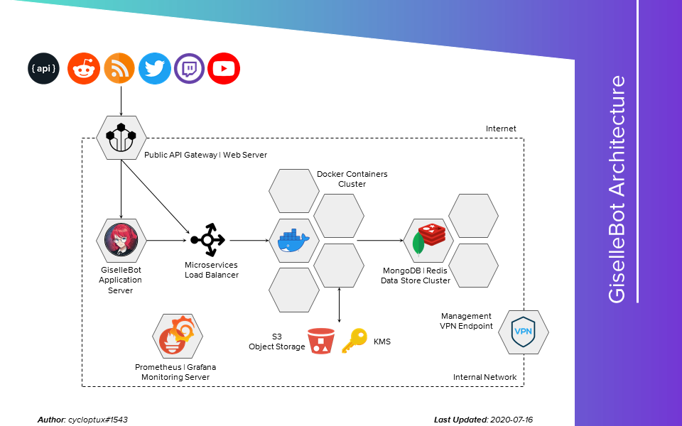

*******************************
Technical & Security Background
*******************************

Other than being a developer, I work as an IT Security Analyst for a big IT company (10K+ employees) in the Telecom & Media industry. This security background also drove a lot of choices during the bot development and deployment, which will be listed and described in this page.

....

Core Engine
===========

The bot is written in Node.js, and uses `Discord.js v12 <https://discord.js.org/>`_ as core Discord library.

Here are some info and numbers about the bot (as of July 16th, 2020):

* 99.9% uptime.
* 25 self-developed RESTful microservices, supporting the bot in its operations.
* ~34,000 lines of code for the main process, and ~10,000 extra lines of code for the custom microservices, excluding JSON/data files.
* Present in ~1500 Discord servers.
* Development started in September, 2017, making GiselleBot 3 years old.
* GiselleBot turned from being a private bot into a public bot in March, 2018.
* Since its launch, GiselleBot has handled over 178,000 successful commands, with an average of 205 successful commands per day.

....

Infrastructure
==============

The bot is hosted in a public cloud infrastructure (specifically, Amazon Web Services). The infrastructure is currently composed of 5 main components:

* 1 Web Server, hosting the bot dashboard (work-in-progress), documentation website and the API gateway used to communicate with the bots from the external world.
* 1 Application Server, hosting the bot itself.
* 3 MongoDB machines, forming a high-availability Replica Set.
* 3 Redis instances, forming a high-availability set managed through Redis Sentinel.

  * Redis is used a high performance in-memory cache for the most used DB queries.
  * The instances are hosted on the same servers that host MongoDB, but the Primary instance of each datastore is on different servers at any time.

* 1 Container Platform, currently composed of a cluster of 5 server instances, hosting the supporting microservices.

Other than the plain computing power, the cloud infrastructure offers a few other managed services used by the bot:

* An advanced L7 Load Balancer, used to balance the requests sent by the bot(s) to the additional microservices (running in a high-availability configuration).
* Object Storage buckets, hosting the temporary (encrypted) files that are sent to end-users via a variety of commands.
* A DNS managed service, hosting the public cycloptux.com and gisellebot.com domains, the short gisl.eu domain and the internal private domain.
* A Key Management System, storing the secret keys and API keys used by the bot. Private keys and/or credentials are never stored on the actual servers, they are fetched during the startup of each service.
* An IAM service, enabling the virtual servers to communicate with the cloud services without having to store credentials within the system itself.
* An automatic build & deployment pipeline service, updating the documentation website as soon as a change is pushed to the `GitHub documentation repository <https://github.com/cycloptux/GiselleBot-Documentation>`_. The same pipeline service is used to build the Docker images for the RESTful microservices used on the Container Platform.

....

Security
========

Regarding the security aspects of the bot, here's a list of features that have been implemented:

Encryption in Transit
---------------------
* Internal network communications between the web server, application server, microservices and DB/Cache server(s) only happen on a private network within the cloud infrastructure and never go through the internet.
* Network connections between the application server, web server, microservices and DB machines are encrypted using SSL/TLS (specifically, TLS 1.1+) encryption, with 2-way forced validation of server and client certificates.
* Network connections between the API gateway and the application server and microservices are encrypted using HTTPS (TLS 1.2+) encryption, with forced 2-way validation of server and client certificates.
* The certificates used to encrypt data in transit are released by an internal Certificate Authority (which is powered off when not in use, to protect its keys). The certificates are signed by an intermediate CA which then points at the root CA, so that the root CA key is never used and the intermediate CA can be killed if compromised.
* The web server and API gateway are only exposed to the internet through HTTPS (HSTS). The web access itself is protected through `Cloudflare <https://www.cloudflare.com/>`_. The network connection between Cloudflare and the actual web server is also protected by strict HTTPS using automatically renewed certificates signed by `Let's Encrypt <https://letsencrypt.org/>`_.

Encryption at Rest
------------------
* All storage media (hard disks, object storage repositories, etc.) are protected through low-level encryption.
* Potentially sensitive and personal data (basically, anything that can be assimilated to a string) stored in the database is encrypted using military-grade AES-256-GCM and AES-128-GCM algorithms.
* Commands that generate big files (such as a chat log) may transmit the file to the user via Direct Message by temporarily storing it into an encrypted Object Storage bucket. The archive itself is also encrypted using 7-Zip's encryption algorithm, based on AES-256.
  
  * The password is purposefully never logged into the bot internal logs and is only known to the end user.
  * As an extra layer of security, users can decide to delete the bot's message so that the password is also removed from Discord itself. Refer to :ref:`deletedm` for more info.
  * The retention for these files is currently set to 30 days. Lowering the retention to 7 or 14 days is under consideration.
 

Authentication, Authorization, Auditing
---------------------------------------
* SSH access to the infrastructure is only available from within the internal network. The internal network can be accessed through a hardened VPN endpoint.
* SSH access to the virtual servers is protected via private keys and, in some cases, multi-factor authentication.
* Authorization between the virtual servers and the external cloud services is managed by IAM roles on the infrastructure-level so that credentials don't need to be stored on the servers.
* Sensitive information needed by the microservices are either fetched from the KMS when the microservice starts, or passed through temporary environmental variables.
* Every access and action is logged, both in the API gateway and in the application server. All bot commands are logged.
* The API offered by the bots are not directly accessed from the internet. The API gateway acts as a bridge, and implements a fully fledged authentication and authorization workflow used to create and distribute temporary tokens to the end users. Further authorization checks are applied on the specific API calls to restrict "authorized" users from requesting data that doesn't belong to them.

Infrastructure Security
-----------------------
* Each host is protected by an infrastructure firewall **and** a local firewall, making sure that only the required ports are open.
* The SSH service is not exposed to the internet.
* Cloud infrastructure management portals are protected by strong passwords and multi-factor authentication.
* Encryption keys, secret access keys, secret tokens, credentials, etc. are **never** stored into local drives. An external Key Management System (KMS) is used to fetch secret keys at runtime.
* The database is backed up every 12 hours, and the retention policy for backup files is set to keep backups on a highly available Object Storage repository for at least 30 days.
* The source code for the bot, and all of its related dependencies, is stored in private Git-based repositories, and the configuration files are also saved every 12 hours.
